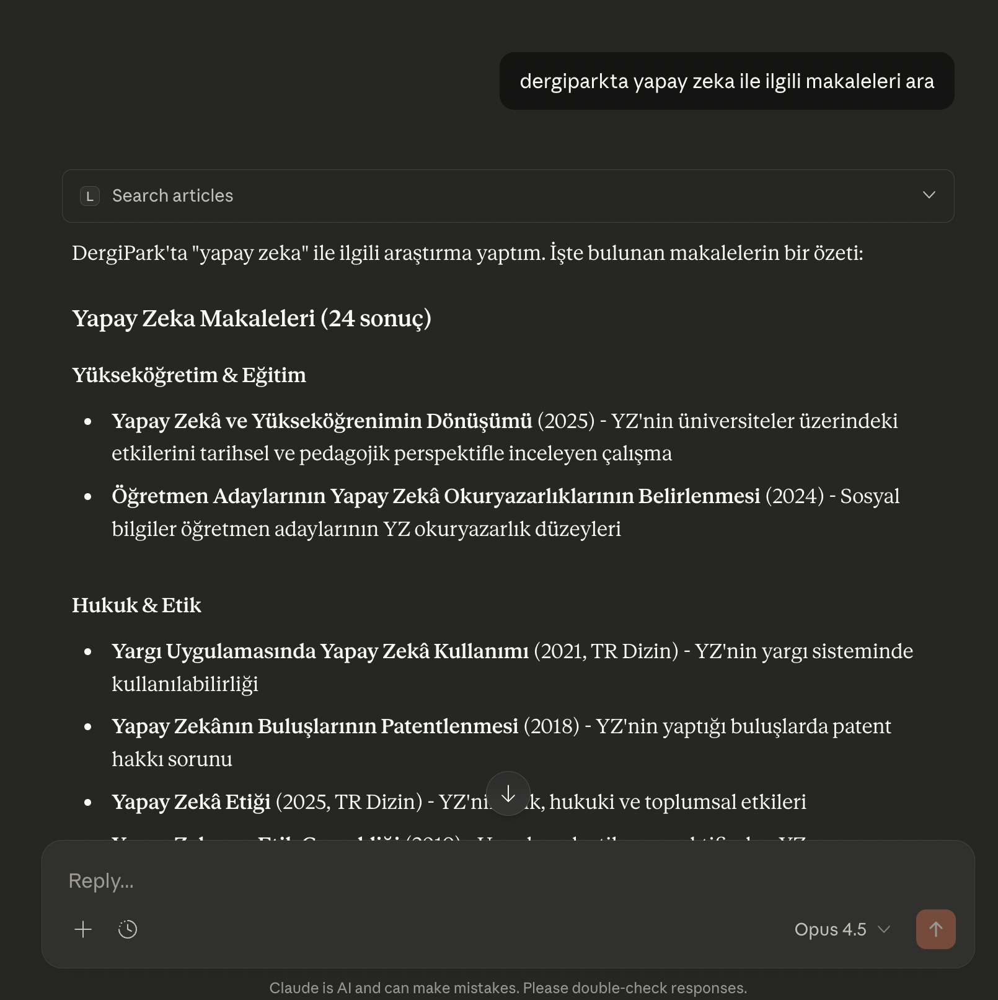

# Literatür MCP: Türk Akademik Dergileri için MCP Sunucusu

## Word'den UDF'ye profesyonel dönüşüm için yeni uygulamam [udfcevir.com](https://udfcevir.com) adresinde!



Bu proje, [DergiPark](https://dergipark.org.tr) üzerinden Türk akademik dergi makalelerine erişimi kolaylaştıran bir [FastMCP](https://gofastmcp.com/) sunucusu oluşturur. Bu sayede, makale arama, PDF dönüştürme ve referans çekme işlemleri, Model Context Protocol (MCP) destekleyen LLM (Büyük Dil Modeli) uygulamaları (örneğin Claude Desktop veya [5ire](https://5ire.app)) ve diğer istemciler tarafından araç (tool) olarak kullanılabilir hale gelir.

---

## 🚀 5 Dakikada Başla (Remote MCP)

### ✅ Kurulum Gerektirmez! Hemen Kullan!

🔗 **Remote MCP Adresi:** `https://literatur-mcp.surucu.dev/mcp`

### Claude Desktop ile Kullanım

1. **Claude Desktop'ı açın**
2. **Settings → Connectors → Add Custom Connector**
3. **Bilgileri girin:**
   - **Name:** `Literatür MCP`
   - **URL:** `https://literatur-mcp.surucu.dev/mcp`
4. **Add** butonuna tıklayın
5. **Hemen kullanmaya başlayın!** 🎉

### Google Antigravity ile Kullanım

1. **Agent session** açın ve editörün yan panelindeki **"…"** dropdown menüsüne tıklayın
2. **MCP Servers** seçeneğini seçin - MCP Store açılacak
3. Üstteki **Manage MCP Servers** butonuna tıklayın
4. **View raw config** seçeneğine tıklayın
5. `mcp_config.json` dosyasına aşağıdaki yapılandırmayı ekleyin:

```json
{
  "mcpServers": {
    "literatur-mcp": {
      "serverUrl": "https://literatur-mcp.surucu.dev/mcp/",
      "headers": {
        "Content-Type": "application/json"
      }
    }
  }
}
```

> 💡 **İpucu:** Remote MCP sayesinde Python, uv veya herhangi bir kurulum yapmadan doğrudan Claude Desktop üzerinden DergiPark akademik makalelerine erişebilirsiniz!

---

## 🎯 Temel Özellikler

- **Makale Arama**: Yıl, tür, dizin ve sıralama filtrelerine göre akademik makaleleri arayın
- **PDF'den HTML'e**: Akademik PDF'leri okunabilir HTML formatına dönüştürün
- **Akıllı OCR**: Taranmış PDF'ler için otomatik Mistral OCR fallback
- **CAPTCHA Çözme**: CapSolver API ile otomatik Turnstile/reCAPTCHA çözümü
- **Cookie Kalıcılığı**: Cookie'ler disk ve belleğe kaydedilir, CAPTCHA tekrarını önler
- **Paralel İşleme**: 3 eşzamanlı HTTP isteği ile hızlı makale çekme
- **Referans Çekme**: Makale referans listelerini otomatik olarak çekin
- **Önbellekleme**: Cookie (30dk), link (10dk) ve PDF (24s) için bellek içi önbellek

---

<details>
<summary>🚀 <strong>Claude Haricindeki Modellerle Kullanmak İçin Kurulum (Örnek: 5ire için)</strong></summary>

Bu bölüm, DergiPark MCP aracını 5ire gibi Claude Desktop dışındaki MCP istemcileriyle kullanmak isteyenler içindir.

* **Python Kurulumu:** Sisteminizde Python 3.11 veya üzeri kurulu olmalıdır. Kurulum sırasında "**Add Python to PATH**" (Python'ı PATH'e ekle) seçeneğini işaretlemeyi unutmayın. [Buradan](https://www.python.org/downloads/) indirebilirsiniz.
* **`uv` Kurulumu:**
    * **Windows Kullanıcıları (PowerShell):** `powershell -ExecutionPolicy ByPass -c "irm https://astral.sh/uv/install.ps1 | iex"`
    * **Mac/Linux Kullanıcıları (Terminal):** `curl -LsSf https://astral.sh/uv/install.sh | sh`
* İşletim sisteminize uygun [5ire](https://5ire.app) MCP istemcisini indirip kurun.
* 5ire'ı açın. **Workspace -> Providers** menüsünden kullanmak istediğiniz LLM servisinin API anahtarını girin.
* **Tools** menüsüne girin. **+Local** veya **New** yazan butona basın.
    * **Tool Key:** `literatur-mcp`
    * **Name:** `Literatür MCP`
    * **Command:**
        ```
        uvx --from git+https://github.com/saidsurucu/literatur-mcp literatur-mcp
        ```
    * **Environment Variables:**
        ```
        CAPSOLVER_API_KEY=your_capsolver_key
        MISTRAL_API_KEY=your_mistral_key
        ```
    * **Save** butonuna basarak kaydedin.

</details>

---

<details>
<summary>⚙️ <strong>Claude Desktop Manuel Kurulumu</strong></summary>

1.  **Ön Gereksinimler:** Python ve `uv`'nin sisteminizde kurulu olduğundan emin olun.
2.  Claude Desktop **Settings -> Developer -> Edit Config**.
3.  Açılan `claude_desktop_config.json` dosyasına `mcpServers` altına ekleyin:

    ```json
    {
      "mcpServers": {
        "Literatür MCP": {
          "command": "uv",
          "args": ["run", "python", "mcp_server.py"],
          "cwd": "/path/to/literatur-mcp/dergipark-api",
          "env": {
            "CAPSOLVER_API_KEY": "your_capsolver_key",
            "MISTRAL_API_KEY": "your_mistral_key"
          }
        }
      }
    }
    ```
4.  Claude Desktop'ı kapatıp yeniden başlatın.

</details>

---

<details>
<summary>🛠️ <strong>Kullanılabilir Araçlar (MCP Tools)</strong></summary>

Bu FastMCP sunucusu **3 MCP aracı** sunar:

### **search_articles**
DergiPark'ta akademik makale arar. Sayfa başına 24 makale döndürür.

| Parametre | Tip | Varsayılan | Açıklama |
|-----------|-----|------------|----------|
| `query` | string | `""` | Arama sorgusu (ör: "yapay zeka") |
| `page` | int | `1` | Sayfa numarası (sayfa başına 24 makale) |
| `sort` | string | `null` | Sıralama: `newest` veya `oldest` |
| `article_type` | string | `null` | Makale türü (ör: `54` = Araştırma Makalesi) |
| `year` | string | `null` | Yayın yılı filtresi (ör: `2024`) |
| `index_filter` | string | `hepsi` | Dizin filtresi: `tr_dizin_icerenler`, `bos_olmayanlar`, `hepsi` |

**Örnek Yanıt:**
```json
{
  "pagination": {"page": 1, "per_page": 24, "count": 24},
  "articles": [
    {
      "title": "Makale Başlığı",
      "url": "https://dergipark.org.tr/tr/pub/dergi/article/123456",
      "details": {
        "citation_author": "Yazar Adı",
        "citation_journal_title": "Dergi Adı",
        "citation_publication_date": "2024",
        "citation_abstract": "Makale özeti...",
        "citation_keywords": "anahtar1, anahtar2",
        "citation_doi": "10.1234/ornek"
      },
      "indices": "TR Dizin, DOAJ",
      "pdf_url": "https://dergipark.org.tr/tr/download/article-file/123456"
    }
  ]
}
```

### **pdf_to_html**
DergiPark PDF'ini okunabilir HTML formatına dönüştürür.

| Parametre | Tip | Açıklama |
|-----------|-----|----------|
| `pdf_id` | string | DergiPark makale dosya ID'si (ör: `118146`) |

URL otomatik oluşturulur: `https://dergipark.org.tr/tr/download/article-file/{pdf_id}`

**PDF İşleme Akışı:**
1. PDF'i DergiPark'tan indir
2. PyMuPDF ile metin çıkar
3. Metin < 100 karakter ise (taranmış PDF) Mistral OCR kullan
4. Formatlanmış HTML döndür

### **get_article_references**
Makale referans listesini çeker.

| Parametre | Tip | Açıklama |
|-----------|-----|----------|
| `article_url` | string | DergiPark makale URL'i |

</details>

---

<details>
<summary>🐳 <strong>Docker ile Çalıştırma</strong></summary>

```bash
# Build
docker build -t dergipark-mcp .

# Run
docker run -p 8000:8000 \
  -e CAPSOLVER_API_KEY=your_key \
  -e HEADLESS_MODE=false \
  dergipark-mcp
```

</details>

---

## 📋 Ortam Değişkenleri

| Değişken | Zorunlu | Açıklama |
|----------|---------|----------|
| `CAPSOLVER_API_KEY` | Evet | CAPTCHA çözümü için CapSolver API anahtarı |
| `MISTRAL_API_KEY` | Hayır | Taranmış PDF'ler için Mistral OCR API anahtarı |
| `HEADLESS_MODE` | Hayır | Tarayıcı modu: `true` veya `false` (varsayılan) |

---

## 📄 Lisans

MIT
